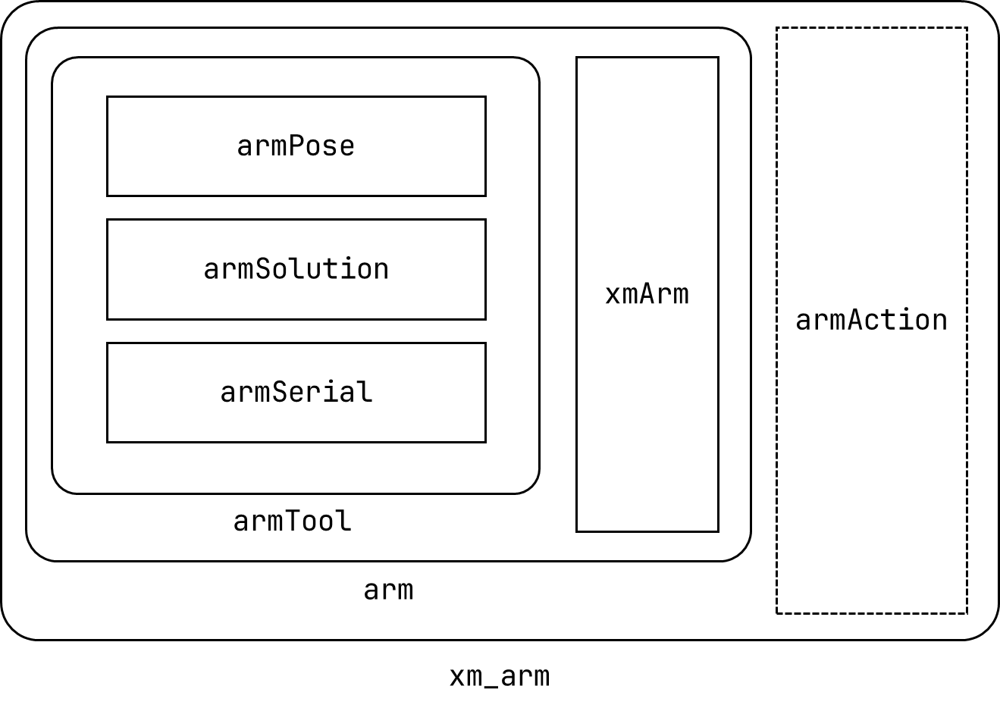

# 机械臂文档

详细介绍了机械臂代码的各部分的功能和使用方法。

## 机械臂代码结构

{width=50%}

-   **:material-chevron-down: `armTool`：机械臂功能包**

        [`armSolution`：机械臂解算方法。](#armsolution){style="text-align:left;" #width .md-button}

        [`armSerial`：机械臂串口通信有关功能。](#armserial){style="text-align:left;" #width .md-button}

        

        - [:material-chevron-down: `armState`：机械臂姿态描述，控制和信息导出。](#armstate){style="text-align:left;" #width .md-button}

            

            -   `armInfo`：机械臂物理信息。

            -   `GripperPose`：机械臂夹爪枚举类。

            -   `armPose`：机械臂姿态描述。

            -   `armStruct`：机械臂信息数据帧构造。

            

    

    

-   **`armControler`：封装功能包功能，提供控制机械臂的功能。**

-   **`armAction`：通过 Action 通信，实现与状态机对接。**

## 机械臂代码功能文档

-   ### `armState`

    [机械臂结构](机械/机械臂结构.md){#width .md-button}

    [数据帧格式](电子/数据帧格式.md){#width .md-button}

    [数据帧构造](电子/数据帧构造.md){#width .md-button}

-   ### `armSolution`

    [未完成](解算/计算文档.md){#width .md-button}

-   ### `armSerial`

    [串口通信](电子/串口通信.md){#width .md-button}

