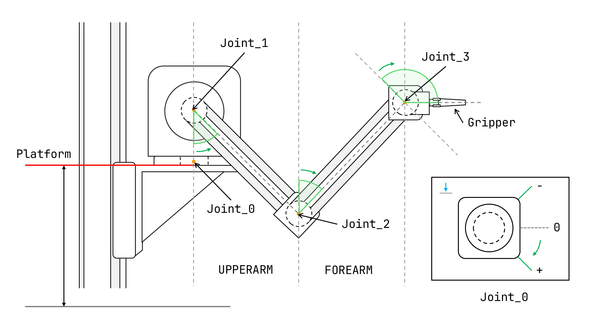
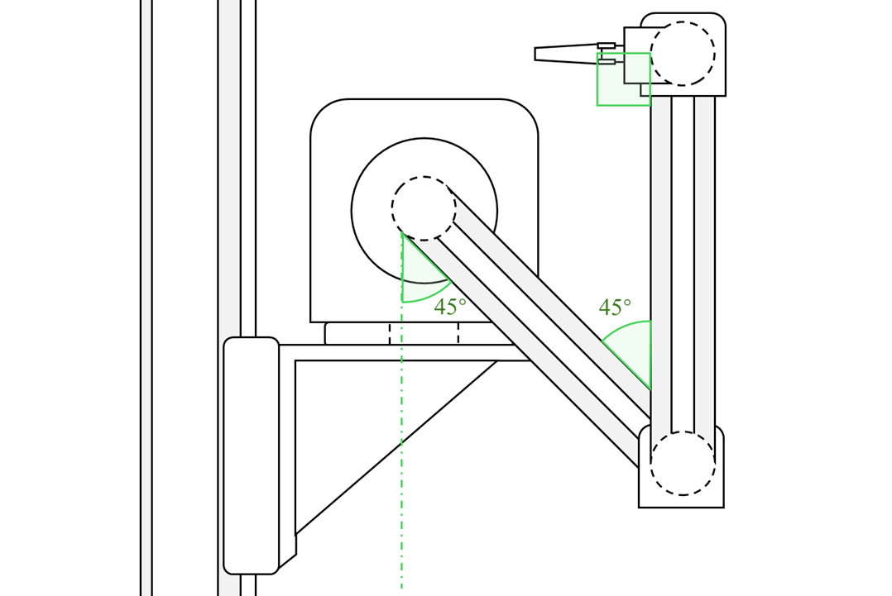
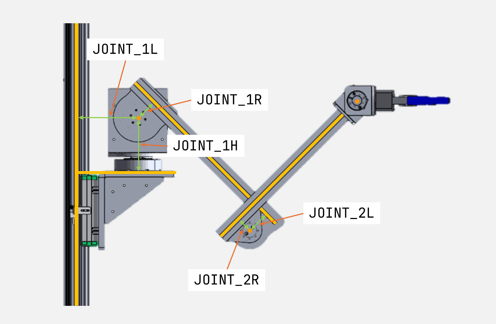

# 机械臂结构

为了方便描述机械臂的结构，下面介绍机械臂各部件的别名和功能。机械臂的结构会经常做出调整，但只要主要结构保持不变，就可以使用相同的方法进行描述。

## 机械臂的基本结构

机械臂的基本结构由机械臂的基本部件组成，主要包括：机械臂的臂架、机械臂的关节、机械臂的末端执行器。

### 机械臂的臂架

机械臂的臂架是机械臂的主体结构，用于支撑机械臂的其他部件。机械臂的臂架通常由铝合金、碳纤维等材料制成，具有一定的刚性和强度。

### 机械臂的关节

机械臂的关节是机械臂的运动部件，用于连接机械臂的各个部件。机械臂的关节通常由电机、减速器、编码器等部件组成，用于实现机械臂的运动。

### 机械臂的末端执行器

机械臂的末端执行器是机械臂的工作部件，用于实现机械臂的工作功能。机械臂的末端执行器通常由夹爪、吸盘、激光头等部件组成，用于实现机械臂的工作功能。

## 机械臂的主要结构名称和关系

### 机械臂的关节

| 机械臂关节 |     电机名称     |   变量名   |
| :--------: | :--------------: | :--------: |
|  Platform  | 滑台（步进电机） | `platform` |
|  Joint_0   |     一号电机     | `joint_0`  |
|  Joint_1   |     二号电机     | `joint_1`  |
|  Joint_2   |     三号电机     | `joint_2`  |
|  Joint_3   |     四号电机     | `joint_3`  |
|  Gripper   |       爪子       | `gripper`  |

-   各个电机的旋转方向如上图绿色箭头所示，其中一号电机图示为垂直向下观察。
-   注意电子中电机编号从**一**开始，而软件中编号从**0**开始。
-   各个电机的初始位置见下图：

    

### 机械臂的臂架

| 名称 |         变量名         |                      含义                      |
| :--: | :--------------------: | :--------------------------------------------: |
| 滑台 | `PLATFORM`或`platform` |    机械臂的底座，用于支撑机械臂的其他部件。    |
| 大臂 |       `UPPERARM`       |    机械臂的第一段臂架，用于连接滑台和小臂。    |
| 小臂 |       `FOREARM`        | 机械臂的第二段臂架，用于连接大臂和末端执行器。 |
| 爪子 |       `gripper`        | 机械臂的末端执行器，用于实现机械臂的工作功能。 |

-   滑台高度为机械臂底座上表面距离地面的垂直距离。
-   滑台变量名为`PLATFORM`时表示默认初始位置距离地面的高度，`platform`表示经过移动后的滑台高度。
-   大臂、小臂的名称参考人体胳膊的结构，大臂为上臂（靠近滑台），小臂为前臂（远离滑台）。

### 机械臂的距离修正变量

在机械臂真正的物理结构中，各个部件之间的距离可能会有一定的误差，为了保证机械臂的运动精度，需要对机械臂的距离进行修正。

|   变量名   |                  含义                  |
| :--------: | :------------------------------------: |
| `JOINT_1H` |    1 号电机距离机械臂底座的垂直高度    |
| `JOINT_1L` |    1 号电机距离滑杆中心点的水平距离    |
| `JOINT_1R` | 1 号电机中心点距离大臂中轴线的垂直距离 |
| `JOINT_2L` | 2 号电机中心点距离大臂中轴线的垂直距离 |
| `JOINT_2R` |  2 号电机中心点就小臂中轴线的垂直距离  |

-   1 号电机为电子二号电机，2 号电机为电子三号电机。
-   `L`为水平方向修正变量，`H`为垂直方向修正变量，`R`为电机半径修正变量。（仅用作方便记忆，与实际情况有所偏差）

## 机械臂结构测量数据

机械臂结构测量数据如下（单位：mm）：

|   机械臂部件    |  变量名称  |      测量数据      |
| :-------------: | :--------: | :----------------: |
|    大臂长度     | `UPPERARM` | 314.92764962765654 |
|    小臂长度     | `FOREARM`  |        340         |
|    爪子长度     | `GRIPPER`  |       183.71       |
|   机器人高度    |  `ROBOT`   |      1446.92       |
|  滑台初始高度   | `PLATFORM` |       787.2        |
| 1 号电机 H 修正 | `JOINT_1H` |       121.5        |
| 1 号电机 L 修正 | `JOINT_1L` |       150.54       |
| 1 号电机 R 修正 | `JOINT_1R` | 47.44818331611865  |
| 2 号电机 L 修正 | `JOINT_2L` | 54.07967547979555  |
| 2 号电机 R 修正 | `JOINT_2R` |        31.7        |
