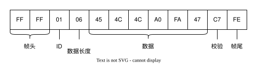
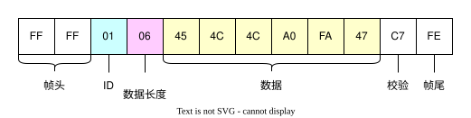
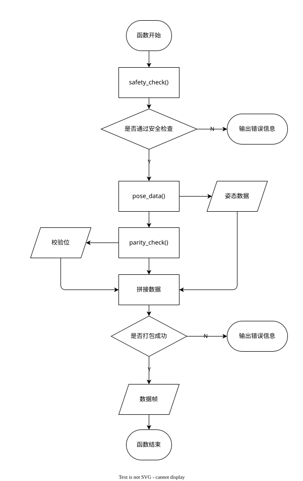

# 数据帧的构造

数据帧是一种用于数据传输的数据格式，用于将数据打包成一个整体，以便于传输。数据帧通常包括帧头、数据、校验位和帧尾。帧头和帧尾用于标识数据帧的开始和结束，校验位用于校验数据的完整性。数据帧的构造是将数据打包成一个整体的过程，通常包括数据的格式化、校验和拼接。

注：数据帧为计算机网络通信的基本概念，仅作为方便理解，并非完全符合相关定义。

在 armTool 中，数据帧的构造由`armStruct`类实现。

## 数据帧格式



详细说明见：[数据帧格式](数据帧格式.md#_3)

## `armStruct` 类

### 构造方法

方法原型：`__init__(self, pose: armPose)`

在构造数据帧时，需要机械臂姿态的有关信息，因此在构造方法中传入`armPose`类的实例。

```python
self.target_pose = pose
self.pose_list = []
```

其中`self.target_pose`为机械臂姿态信息，`self.pose_list`为数据帧的数据部分。

并且在构造数据帧时，为避免溢出错误和进行角度制度转换，声明了两个匿名函数。

```python
self.fix_negative_overflow = lambda x: x + 70
self.radian_to_angle = lambda radian: radian * 180.0 / math.pi
```

其中`self.fix_negative_overflow`用于修正负数溢出，`self.radian_to_angle`用于将弧度转换为角度。

### 安全角度检查方法

方法原型：`safety_check(self)`

在构造数据帧时，需要对数据进行安全检查，以确保数值在合理范围内。

各个电机的安全范围，目前由经验设定，如下：

| 电机名称 |  变量名称  | 安全范围  |
| :------: | :--------: | :-------: |
|   滑台   | `platform` |  ±140mm   |
| 一号电机 | `joint_0`  | 0° ~ 180° |
| 二号电机 | `joint_1`  | 0° ~ 180° |
| 三号电机 | `joint_2`  | 0° ~ 180° |
| 四号电机 | `joint_3`  | 0° ~ 180° |

电机旋转正方向等相关信息见：[机械臂结构](../机械/机械臂结构.md)

如果数据超出安全范围，则抛出异常`[TIPS] XXX (12.34) out of range [1, 10]`。（XXX 为电机变量名称，12.34 为当前值，1 为下限，10 为上限）

```python
if not (-140 < self.target_pose.plat_move() < 140):
    raise Exception(
        "\033[0;34m[TIPS] Platform ({}) out of range ({}, {}).\033[0m".format(
            self.target_pose.plat_move(), - 140, 140
        )
    )
if not (0 <= self.target_pose.joint_0 <= pi):
    raise Exception(
        "\033[0;34m[TIPS] Joint 0 ({}) out of range [{}, {}].\033[0m".format(
            self.target_pose.joint_0,0,pi
        )
    )
if not (0 <= self.target_pose.joint_1 <= pi / 30):
    raise Exception(
        "\033[0;34m[TIPS] Joint 1 ({}) out of range [{}, {}].\033[0m".format(
            self.target_pose.joint_1,0,pi / 30
        )
    )
if not (0 <= self.target_pose.joint_2 <= pi):
    raise Exception(
        "\033[0;34m[TIPS] Joint 2 ({}) out of range [{}, {}].\033[0m".format(
            self.target_pose.joint_2, 0, 3 * pi / 4
        )
    )
if not (0 <= self.target_pose.joint_3 <= pi):
    raise Exception(
        "\033[0;34m[TIPS] Joint 3 ({}) out of range [{}, {}].\033[0m".format(
            self.target_pose.joint_3,0,pi
        )
    )
```

### 姿态数据构造方法

方法原型：`pose_data(self)`

在构造数据帧前，先将机械臂姿态信息进行变换，使得其能用 2 位 16 进制表示。

```python
pose_format = "B B " + "B " * 6
plat_move_transform = lambda x: int(self.fix_negative_overflow(x / 100))
joint_transform = lambda x: int(
    self.fix_negative_overflow(self.radian_to_angle(x))
)
gripper_transform = lambda x: int(self.fix_negative_overflow(x.value))
self.pose_list = (
    plat_move_transform(self.target_pose.plat_move()),
    joint_transform(self.target_pose.joint_0),
    joint_transform(self.target_pose.joint_1),
    joint_transform(self.target_pose.joint_2),
    joint_transform(self.target_pose.joint_3),
    gripper_transform(self.target_pose.gripper),
)
```

其中`pose_format`为数据格式，`plat_move_transform`、`joint_transform`、`gripper_transform`为数据转换函数。

利用`struct`模块将机械臂姿态信息转换为二进制数据流。如果在转换过程中出现异常，则抛出异常`[ERRO] Pose data transform failed!`。并返回 struct 模块的报错信息。

```python
try:
    pose_data = struct.pack(pose_format, 0x01, 0x06, *self.pose_list)
    return pose_data
except Exception as e:
    print(
        "\033[0;34m[TIPS] Ubyte format requires 0 <= number <= 255, But poselist is {}.\033[0m".format(
            self.pose_list
        )
    )
    print(e)
    raise Exception("\033[0;31m[ERRO] Data format error!\033[0m")
```
执行完毕后，返回机械臂姿态信息的二进制数据流，包括以下信息：



### 校验位计算方法

方法原型：`parity_check(self, data: bytes)`

在构造数据帧时，需要对数据进行校验，以确保数据的完整性，具体校验方法见[数据含义——校验位](数据帧格式.md#_3)。

```python
checksum = 0
for i in data:
    checksum += i
    checksum %= 0xFF
return checksum
```

### 数据帧构造方法

方法原型：`packet_message(self)`

完成数据帧的构造，拼接帧头、ID、数据长度、数据、校验位和帧尾。

调用流程如下：



### 调试方法

1. `show_message(self)`：用于打印数据帧的内容，以十六进制的格式。
2. `show_target_pose(self)`：用于打印机械臂的目标姿态信息。