# URDF 配置过程

## 准备 MoveIt! 环境

略

## 创建工作区

通过下面指令创建 ROS 工作区

```shell
mkdir catkin_ws
cd catkin_ws
mkdir src
catkin_init_workspace
```

将 URDF 解压后放置在 `src` 中，编译工作空间

```shell
cd .. # 返回 catkin_ws 中
catkin_make
```

`source` 工作区

```shell
source catkin_ws/devel/setup.bash
```

## 启动 MoveIt!

打开终端，启动 `moveit_setup_assistant` 功能包，如果报错可新建终端启动 `roscore` 节点

```shell
rosrun moveit_setup_assistant moveit_setup_assistant
```

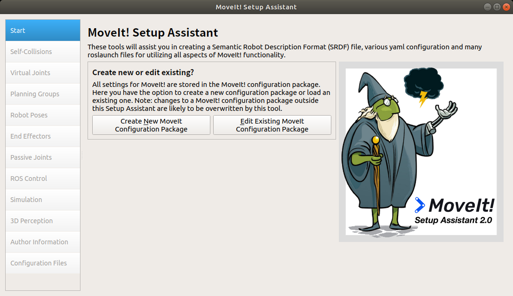

## 配置 URDF

### 打开 URDF 文件

点击创建新的配置，选择 URDF 后缀文件，通常在 `./[name]/urdf/[name].urdf` .

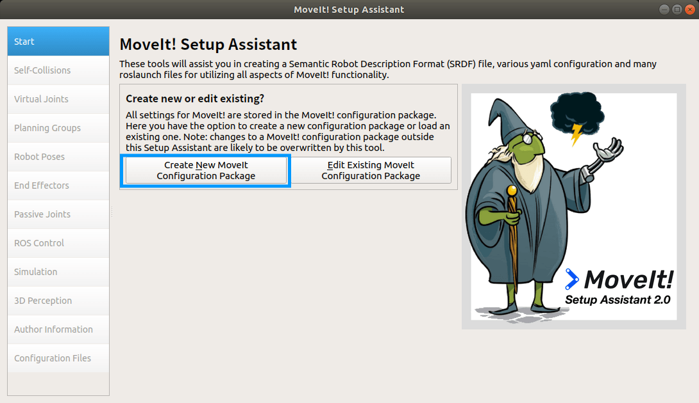

选择完成后，点击加载。

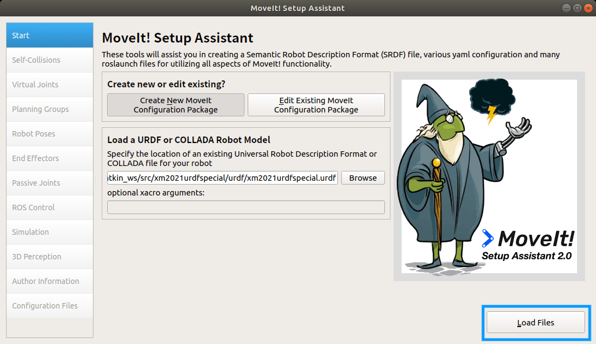

### 生成自碰撞矩阵

选择 `Self-Collisions` 点击 `Generate Collision Matr`，等待数秒即可。

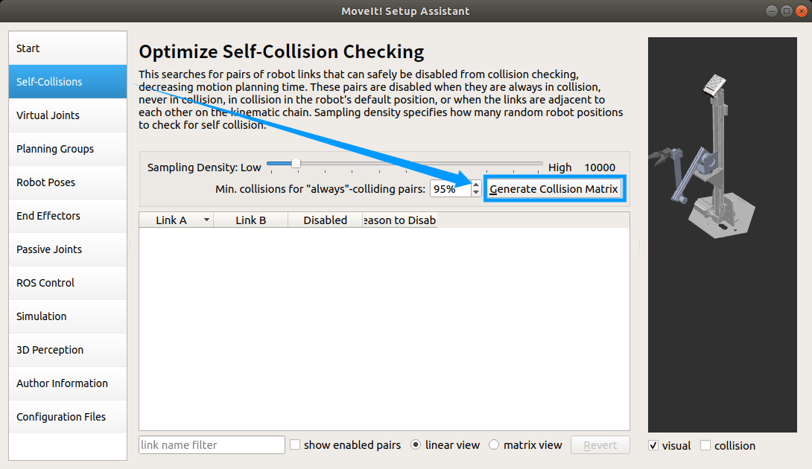

如果生成成功则会显示下面的内容：

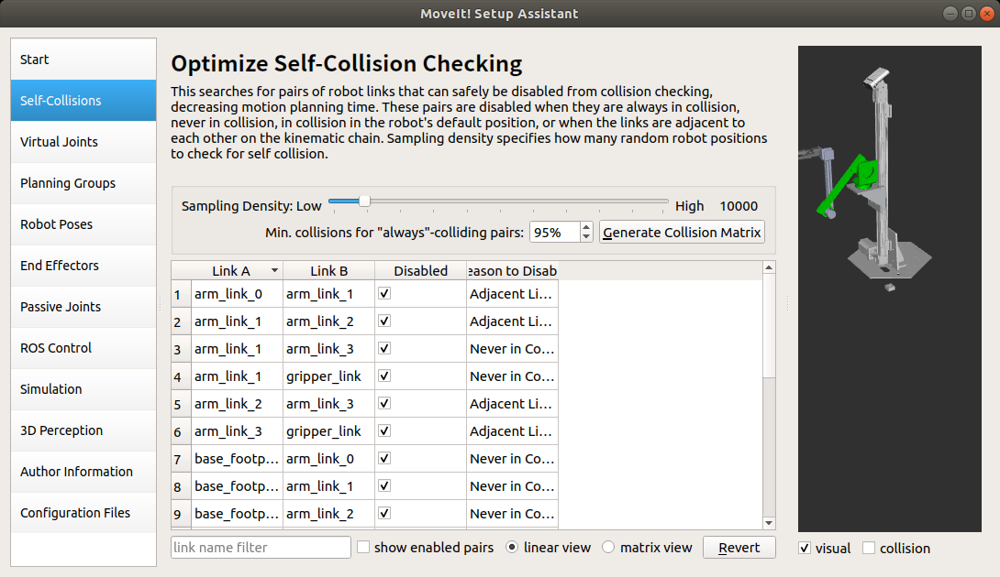

### 设置/虚拟关节

选择 `Virtual Joints`，点击 `Add Virtual Joints` 添加虚拟关节（非必要）。

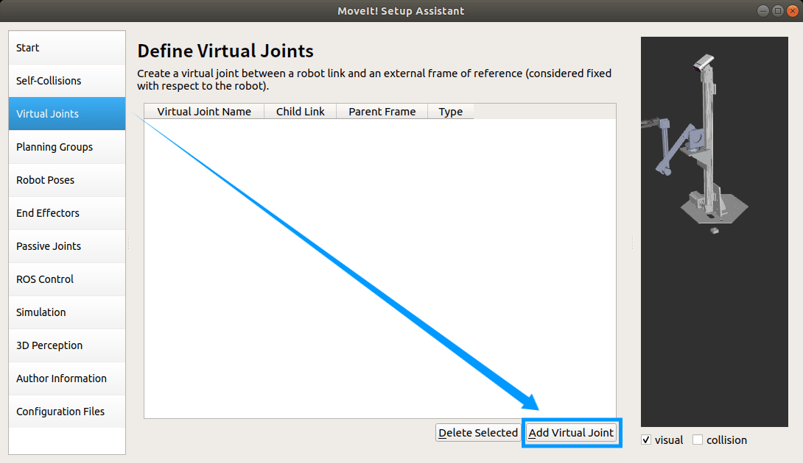

### 添加规划组

选择 `Planning Groups`，点击 `Add Group`，添加机械臂规划组。

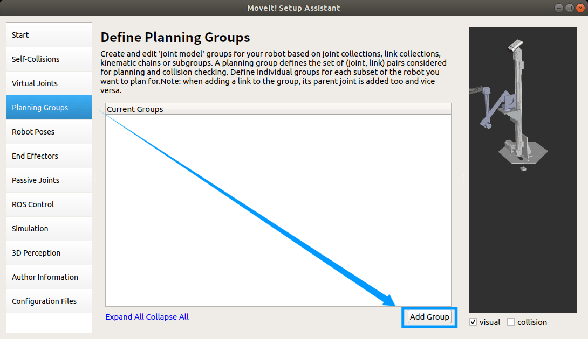

输入规划组名称，选择解算器后点击 `Add Kin. Chain`.

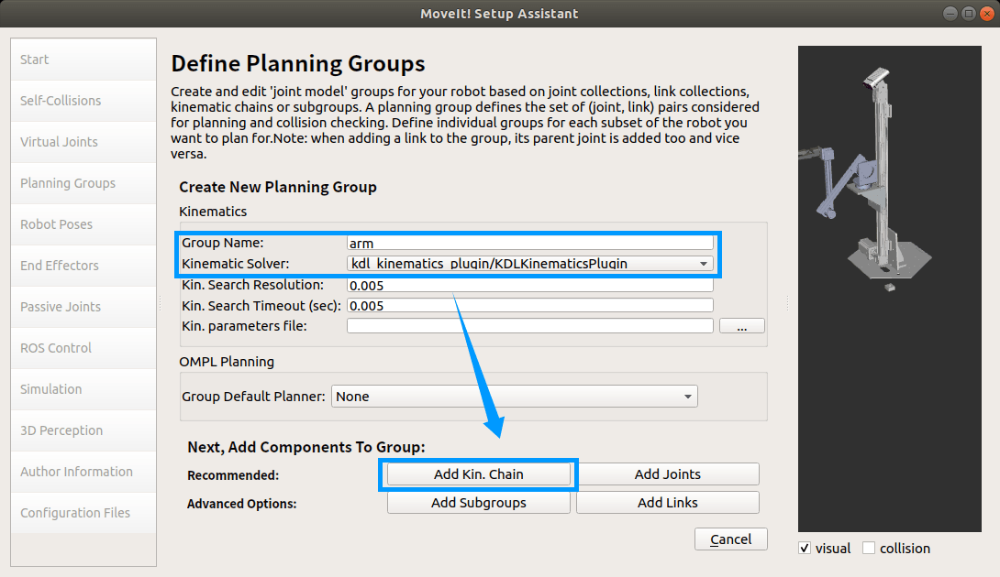

从上方关节中选择机械臂的 `Top_Link` 和 `Base_Link`，确定后保存退出。

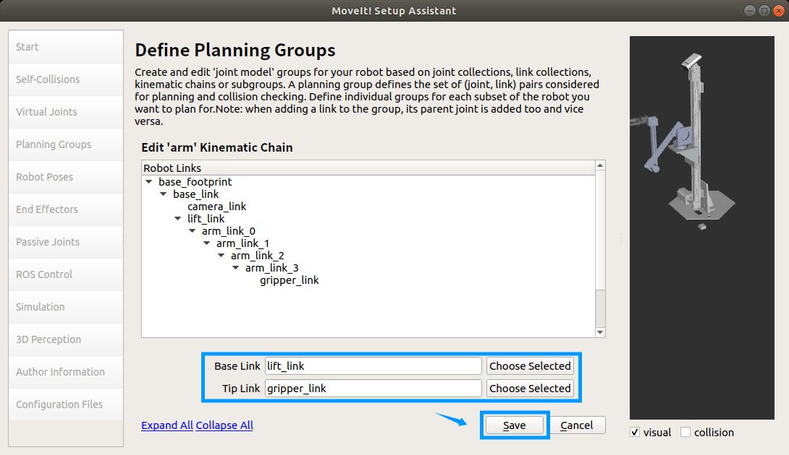

### 设置机器人姿态

选择 `Roboto Poses`，点击 `Add Pose` 添加机器人姿态

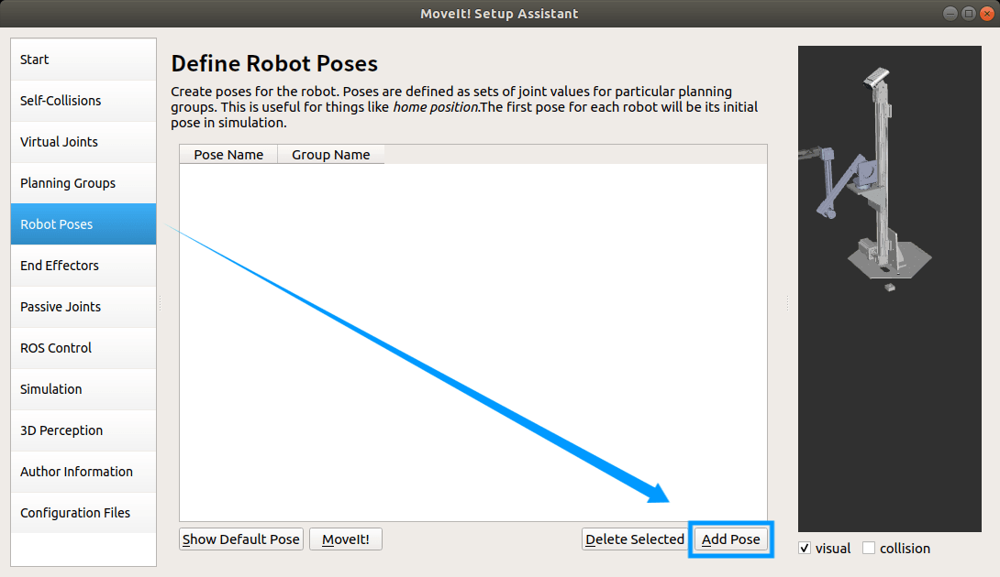

输入姿态名称，选择规划组，拖动右侧滑杆是机器人到达指定姿态后保存。

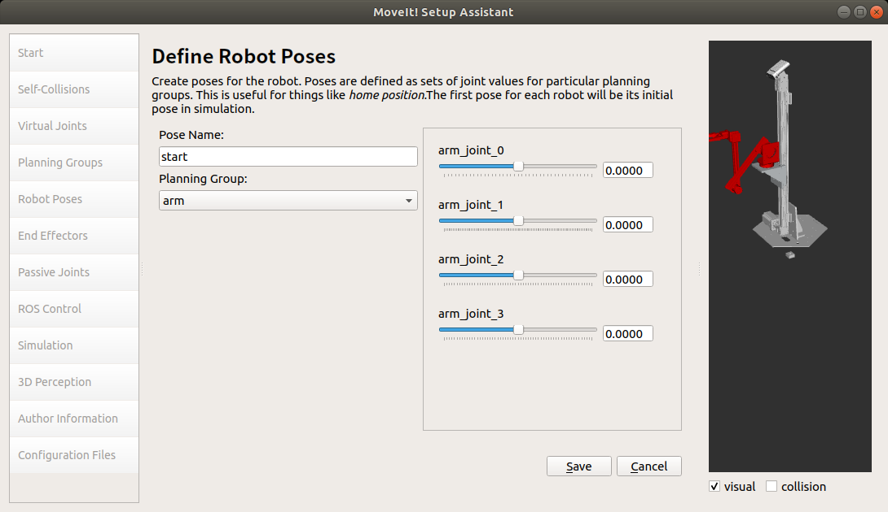

### 设置末端效应器

选择 `End Effectors`，点击 `Add End Effector` 添加末端效应器。

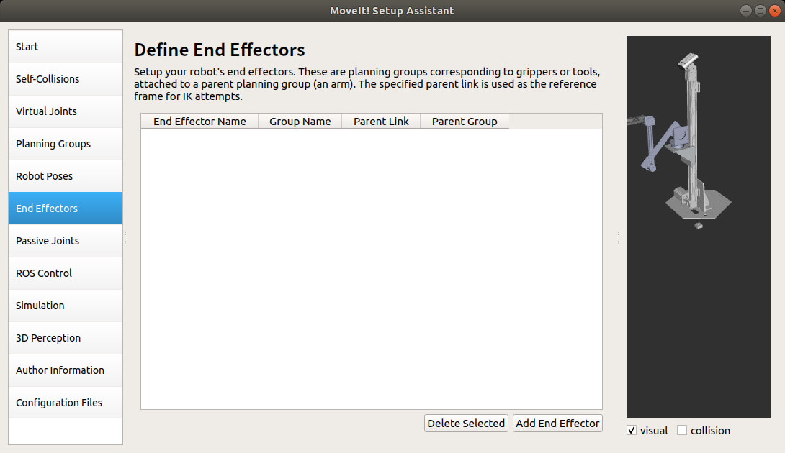

输入名称，选择对应参数后保存。

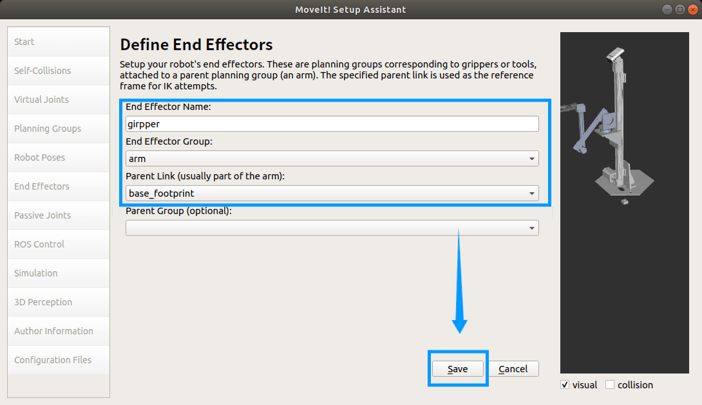

### 设置作者信息并保存

点击 `Author Information` ，输入作者名称和邮箱。

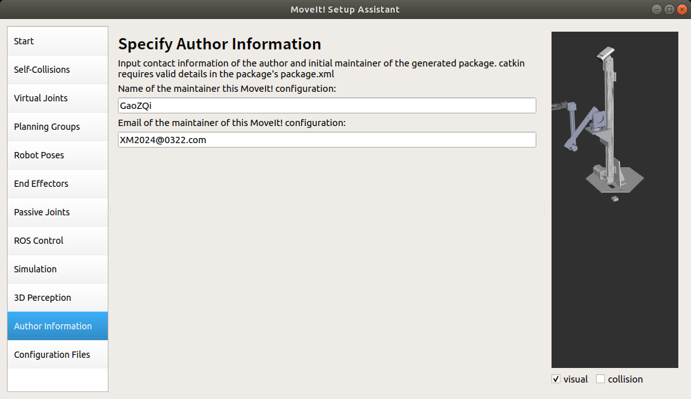

设置 URDF 配置保存路径，点击 `Generate Package`，等待配置文件生成，完成后点击 `Exit Setup Assistant` 退出。

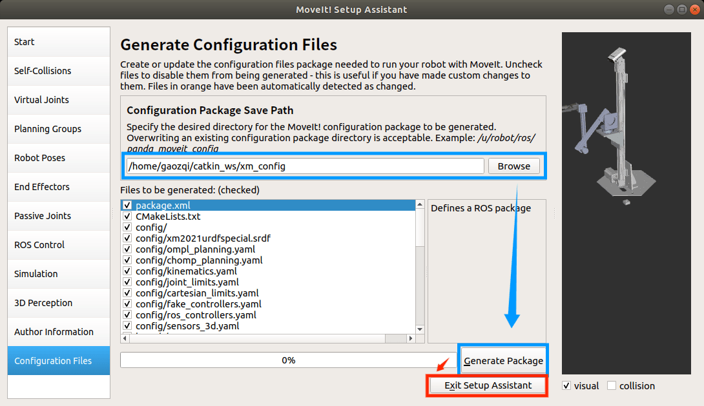

## 常见问题

### 工作区常见问题

1. `catkin_make` 报错。

      返回到工作区根目录再次尝试。

2. 编译工作区时报错，显示非法名称。

      联系机械重新生成 URDF 文件，修改文件名称。

      命名要求：

      - 不能包含 `.`
      - 名字不宜过长

3. MoveIt! 打开 URDF 时，终端报错。

      关闭所有终端，重新 `source` 工作区后，再次尝试。

### MoveIt! 常见问题

1. 关节列表为空。

      联系机械重新生成 URDF 文件。

2. 设置姿态时没有右侧拉杆。

      关闭 GUI 界面，重新打开，先进行自碰撞矩阵生成，然后在进行设置。

3. 设置姿态时右侧拉杆无法移动。

      联系机械重新生成 URDF 文件，修改关节软限位。

      参考文章：[为什么 ROS Moveit setup 中 Define Robot Pose 栏目下滑条无法拖动？ - 知乎](https://www.zhihu.com/question/331351951/answer/1497949829)
